# DSP workbench

A browser-based modular DSP lab: build signal chains by wiring nodes on a canvas. Runs fully client-side, no build step, works offline as a PWA.

## Features

### Workbench
- Node graph editor: pan/zoom canvas, drag-and-drop modules, typed ports (signal, number, spectrum, image, text, block)
- Dashboard view (split panes, draggable dividers) for building instrument-like UIs
- Groups (nested subgraphs) with custom inputs/outputs
- Undo/redo, duplicate, multi-select, module search (Ctrl+K)
- Save/load patches to local storage or JSON files
- 66 built-in presets: demos, quick scenarios, radio protocols, music, analysis
- Adjustable block size, sample rate and run speed (×1…×32)
- AudioWorklet engine, SharedArrayBuffer path when cross-origin isolated
- Installable PWA with offline support

### Sources
- Oscillator, sweep/jammer, constant, LFO, text source
- Microphone (stereo A+B), audio file, audio stream URL, tab/screen audio capture
- **USB SDRs** directly via WebUSB: RTL-SDR, HackRF, Airspy R2/Mini, SDRplay RSP1 / MSi2500 — multiple tuners/demodulators per device, wideband sweep with a panoramic waterfall, IQ recording and playback in WAV / SigMF (see [USB SDR](#usb-sdr))
- **KiwiSDR** remote receivers (public list included)
- Camera, video, image, accelerometer and Generic Sensor API
- **tinySA / tinySA Ultra** spectrum analyzer over WebSerial: sweep into the spectrum/waterfall, screenshots, signal generator (see [tinySA](#tinysa))
- Serial port (WebSerial), CSV files, lists

### Analysis
- Spectrum analyzer / waterfall (optional phosphor view; the waterfall keeps its history at full resolution, so zoom, dB range and palette changes redraw it without losing detail), persistence spectrum, oscilloscope, constellation, eye diagram
- CFAR signal detector (noise estimate in linear power: OS — 75th percentile, robust to strong neighbours; SO — smallest of the two sides; CA — mean; a target is shown after M hits in the last N spectrum frames, so single noise spikes are dropped; outputs SNR of the strongest target and the noise floor), channel SNR, channel grid, band scanner, auto frequency scanner
- Band plans, bookmarks, signal recognition
- **Signal type identifier**: finds every signal in a spectrum from any source and names its modulation — on an SDR from the raw IQ (see [Signal type identifier](#signal-type-identifier))
- Goertzel, autocorrelation, cross-correlation, frequency response / coherence
- Harmonics & THD, third-octaves, LUFS-like loudness, level statistics, spectral descriptors
- Impulse response & RT60, bird song analyzer, frequency meter, trend charts

### Processing
- Filters, gain, mixers (4/12 ch), AGC, squelch, mains notch, adaptive hum canceller (tracks mains frequency, all harmonics), comb notch, adaptive filter, spectral denoiser
- FFT, Zoom-FFT (I/Q), Hilbert transform, quadrature shift, magnitude/phase, wavelet (constant-Q), cepstrum
- Beamformer, phase scope (X-Y), envelope, calibration, capture & loop
- Audio effects: delay, reverb, distortion, compressor/limiter, EQ, chorus/flanger/phaser, pitch shifter

### Modulation & radio
- AM/FM/SSB demodulator, FSK demodulator, generic modulator
- Carrier acquisition, matched filter, symbol sync
- OFDM modulator/demodulator, chirp modem (transmit/receive)
- HF propagation, WWV/WWVH/CHU time decoder
- Doppler radar, 2D chirp radar, monostatic sonar

### Digital modes & decoders
- FT8, RTTY, Morse (TX/RX, including from camera), DTMF, PSK31, Feld Hell
- Olivia, Contestia, AX.25/APRS (TX/RX)
- WEFAX, NOAA APT, SSTV-style raster
- HFDL: full receive chain down to ACARS / ADS-C with aircraft map
- Building blocks: CRC, scrambler, interleaver, convolutional encoder / Viterbi, sync word search, async serial, NRZ clock, text ↔ bits

### Music
- Synths (2 osc, 4 voices), acid bass (303), drum sequencer, sample library
- Piano roll, step sequencer, generative melody, arrangement playlist, master clock
- MIDI keyboard input, ADSR envelope

### Output & extensibility
- Sound card output (per-node output device selection, peak/clip meter), WAV recording, CSV log, trigger recorder
- Aircraft map, screen transmitter, indicators
- Module Builder and Script nodes for writing custom DSP code in the browser

## USB SDR

The **USB SDR** node talks to the receiver directly over WebUSB (Chrome, Edge, Opera), no drivers or native software needed. Up to 4 demodulator channels share one device.

Modes: WFM (stereo, RDS), NFM, AM, SAM, USB, LSB, raw IQ. **SAM** (synchronous AM) locks a PLL onto the carrier and detects coherently: less distortion during selective fading, and **SAM sideband** = USB/LSB keeps only one sideband to dodge interference on the other. In AM/SAM/SSB the tuner is always parked sr/4 away from the channel, so the DC spike never lands on the carrier.

For HF: **noise blanker** cuts short impulses (power-line, switching supplies) on the raw wideband IQ before the channel filter, where a pulse is still short; **auto notch** (NLMS predictor) removes steady whistles/heterodynes from AM/SAM/SSB audio; **SAM sideband = ISB** puts the upper sideband in the left channel and the lower in the right, so you hear which side the interference is on.

| Device | Sample rate | Samples | Linux kernel modules to unload |
|---|---|---|---|
| RTL-SDR (RTL2832U + R820T/R828D, incl. Blog V4) | up to 3.2 MSPS | 8 bit | `dvb_usb_rtl28xxu` |
| HackRF One / Jawbreaker / rad1o | 2–20 MSPS | 8 bit | `hackrf` |
| Airspy R2 / Mini | rates reported by firmware | 12 bit | `airspy` |
| SDRplay RSP1 and clones, MSi2500 + MSi001 TV sticks | 1.3–15 MSPS | 14 bit up to 6 MSPS, then 12 / 10 / 8 bit | `msi001`, `msi2500` |

Common controls: gain (auto or manual), bias-tee, ppm correction, center shift off DC.

**ADC overload**: the status line shows the ADC peak and mean power in dBFS over the last ~0.5 s, and **⚠ OVERLOAD** (held for 3 s) when more than 0.01% of I/Q samples sit on the ADC rails. With an 8-bit RTL-SDR a strong local station easily does that, and the spectrum then fills with intermod products that are not real signals — lower the gain until the warning goes away; a mean level around −30…−15 dBFS is usually a good spot. Outputs `adcPk`, `adcRms` (dBFS), `clip` (% of samples) and `ovl` (0/1) let a patch react, e.g. gate a detector or step the gain down.

The `spec` output uses all the IQ that arrives between updates, not one FFT frame: frames overlap by 50% and their power is averaged (Welch's method, **spectrum averaging** sets the maximum number of frames, `all` by default). At 2.4 MSPS with a 4096-point FFT that is ~90 frames per update, so the noise floor spread drops from ~±5 dB to ~±0.5 dB and weak carriers stand out; detectors (CFAR, channel SNR) can run with a lower threshold. Levels are in dBFS: 0 dB is a full-scale complex tone, whatever the window.

**Signal level and squelch** (per channel): RSSI is the power inside the channel filter in dBFS (for FM and SSB a separate sharp band filter is used for the measurement, so neighbours in the transition band don't count); SNR is taken from the spectrum — mean level inside the channel against the quieter of the two bands just outside it, so a busy neighbour on one side does not raise the noise estimate. **squelch** mutes a channel by `SNR` (does not depend on gain) or by `level` (RSSI threshold, dBFS), with 3 dB hysteresis and a **hang** time; the gate is applied to the audio exactly at the chunk the level was measured on. Outputs `rssi`/`snr` (and `rssi2…4`, `snr2…4` for the other channels) and `sqOpen` for channel 1, e.g. to start a recorder. On a Spectrum Analyzer wired to `spec` the channel band shows the squelch in the trace's own scale: a dashed line at the threshold and a solid line at the current mean level in the channel (solid above dashed — open, the band label says `SQL open/closed`); a marker sitting on a channel shows that channel's RSSI (dBFS) / SNR — exactly the numbers the squelch compares — instead of the peak level around the marker.

Fine marker tuning (e.g. SSB): the mouse wheel over a marker's label moves it by 10 Hz (Ctrl — 1 Hz, Shift — 100 Hz); dragging the label moves it at 1/10 of the normal pan speed; clicking the active marker's label asks for an exact frequency.

- **HackRF** has separate LNA / VGA / amp controls instead of the gain slider.
- **SDRplay / MSi2500** has no hardware AGC: *auto* sets a fixed 62 dB, the manual slider covers 0–102 dB of LNA + mixer + baseband gain. The driver is a port of [libmirisdr-4](https://github.com/f4exb/libmirisdr-4). RSP1A / RSP2 IDs are recognized but untested; RSPduo, RSPdx and newer models need the closed SDRplay API and are not supported.

On Linux unload the kernel driver before connecting, e.g. `sudo rmmod msi001 msi2500`, or blacklist it in `/etc/modprobe.d/`. The device also needs user access through a udev rule (as for `rtl-sdr` / `hackrf` / `airspy` packages).

### Wideband sweep

**wideband sweep** turns the node into a panoramic scanner (like `rtl_power` / `hackrf_sweep`): the receiver steps across **sweep from … to** (MHz), each step keeps the central **usable band fraction** of the FFT (the edges are rolled off by the anti-alias filter), and the pieces are stitched into one spectrum on the `spec` output. A Spectrum Analyzer on it shows the whole range; its waterfall gets one line per full pass. The readout shows the current step and seconds per line.

- **sweep FFT size** sets the resolution (sample rate / size per bin), **averages per step** — how many FFT frames are averaged (or max-held with the **max** detector) at each step
- a marker on `tuneFreq` (e.g. marker 1 of the Spectrum Analyzer wired to it) pauses the sweep and tunes there: the demodulators play as usual and the live spectrum is drawn over its part of the panorama; remove the marker to resume from the same step
- use manual gain: with AGC each step gets its own level and the waterfall is striped. **shift center off DC** keeps the listened station away from the DC spike
- the speed depends on the retune time over USB: roughly 20–50 ms per step, i.e. a few seconds per line for 100 MHz at 2.4 MSPS and ~30–45 s for the whole RTL-SDR range. A HackRF at 20 MSPS covers ~8× more per step
- the Spectrum Analyzer keeps the waterfall history at full resolution (**waterfall history memory**, 128 MB by default), so zooming into an old part of the panorama shows the real bins, not stretched pixels. Over the budget the oldest lines keep only a max-decimated copy
- ready-made patch: **USB SDR: Wideband Sweep**

### IQ recording and playback

- **● Record IQ** writes the stream to a temporary file in the browser's site storage (OPFS, so long recordings don't sit in memory; without it — up to 1 GB in memory); **■ Stop recording** opens the save dialog (or downloads the file). If saving was cancelled or the recording stopped on its own (error, disconnect), press Stop again to save it
  - **WAV** — 2-channel 16-bit PCM with the plain 44-byte header SDR++ expects (8-bit sources are widened to 16 bit); center frequency in the file name (`baseband_<Hz>Hz_…`, SDR++) and in an `auxi` chunk after the data (SDR#, HDSDR); limited to 4 GB
  - **SigMF** — `.sigmf` archive (`.sigmf-data` + `.sigmf-meta`), retuning while recording adds a new `captures` segment
- **Open IQ file…** plays a recording through the same chain (spectrum, 4 channels, demodulators) in real time, with loop and position controls
  - WAV (8/16-bit PCM, 32/64-bit float), SigMF archive or `.sigmf-meta` + `.sigmf-data` pair (`cu8`, `ci8`, `ci16_le`, `cf32_le`, `cf64_le`)
  - raw `.cu8` / `.cs8` / `.cs16` / `.cf32` / `.cf64` (e.g. `rtl_sdr` output; the format is guessed from the extension or set by **IQ file format**): frequency and rate are taken from the file name (`…_433920000Hz_2.4Msps.cf32`), otherwise from the node settings

## tinySA

The **tinySA** node talks to a tinySA or tinySA Ultra over its USB serial console (WebSerial, Chrome/Edge). Wire `spec` to a Spectrum Analyzer to get the trace and a waterfall in dBm.

- **start / stop / points** — sweep range and resolution; `scanraw` (binary, any number of points) is used by default, **transfer format → text** falls back to `scan` (up to 290 / 450 points). Old firmware without `scanraw` is switched to text automatically
- **RBW**, **attenuation**, **spur removal**, **LNA** (Ultra) are sent to the device when changed; **hold** pauses sweeping
- `start` / `stop` inputs (Hz) set the range; `steerFreq` (from `centerFreq` of the Spectrum Analyzer) moves it while keeping the span, so dragging the spectrum pans the tinySA
- outputs: `peakF` / `peakDb` — the highest point of the last sweep
- **Screenshot** reads the device screen (`capture`) to the node and the `img` output, **Save PNG** downloads it
- **gen** (signal generator mode) — `mode low|high output`, frequency, level and **RF on**; `genFreq` (Hz) and `genLevel` (dBm) inputs let the graph drive it (e.g. a stepped frequency sweep)
- ready-made patch: **tinySA: Spectrum**

## Signal type identifier

The **Signal Type Identifier** (`sigid`) node labels every signal it finds and suggests a decoder for it. It doesn't care where the signal comes from:

- `spec`: a spectrum from any node (USB SDR, FFT, tinySA…). The node finds the signals and classifies them by shape: bandwidth (99% power), flat top, carrier over the sidebands, which sideband holds the energy, and on/off keying over time
- USB SDR: the node also reads the **raw IQ at the native sample rate** that comes with the spectrum. It takes one signal at a time, shifts it to zero, decimates it and measures the envelope, the instantaneous frequency, the lines in z, z² and z⁴, and the keying rate. The heavy part runs in a Web Worker
- `in`: audio (microphone, KiwiSDR, a receiver's output). Without `spec` the node computes its own spectrum, and it analyses the audio samples the same way
- `plan`: a band plan for context. Its label is shown next to each signal, and a matching mode adds some confidence

What it recognises: carrier, CW (with WPM), OOK, AM, USB/LSB, NFM (with CTCSS tone), WFM (with the stereo pilot), 2-FSK / 4-FSK with shift and baud (RTTY, AFSK 1200 / APRS, POCSAG, DMR/P25-like 4800 Bd), MFSK (FT8-like, Olivia/Contestia-like), BPSK / QPSK with symbol rate (PSK31…), OFDM, DTMF keys. Each result says whether it came from the spectrum or from the samples. It is a heuristic, not a decoder.

The `bands` output carries the labels. Wire it into a Spectrum Analyzer's `bands`, or into a **Band Plan**'s `sigs` so the labels show together with the bands: each signal gets a bracket at its peak level with its type above it.

Ready-made patches: **USB SDR: Signal Identifier**, **HF: Quick-Decode All Protocols**.

## Themes

The UI follows the system color scheme (`prefers-color-scheme`). Instrument screens (scopes, spectra, waterfalls) stay dark in both themes.

| | Dark | Light |
|---|---|---|
| Desktop — graph | 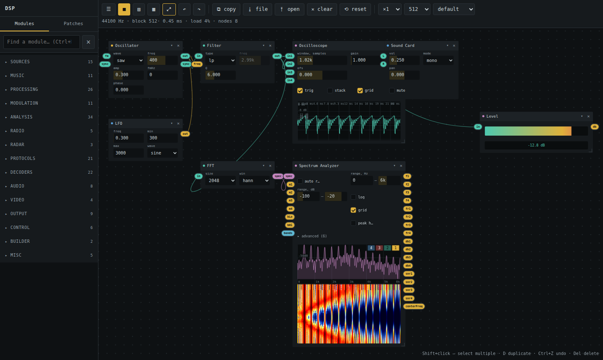 | 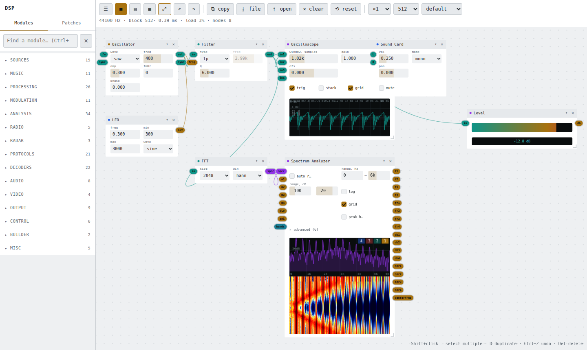 |
| Desktop — dashboard tiles | 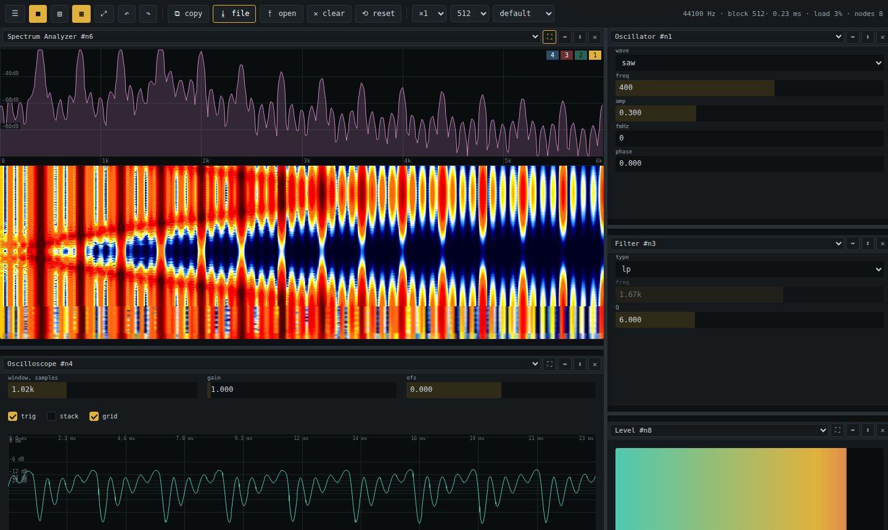 | 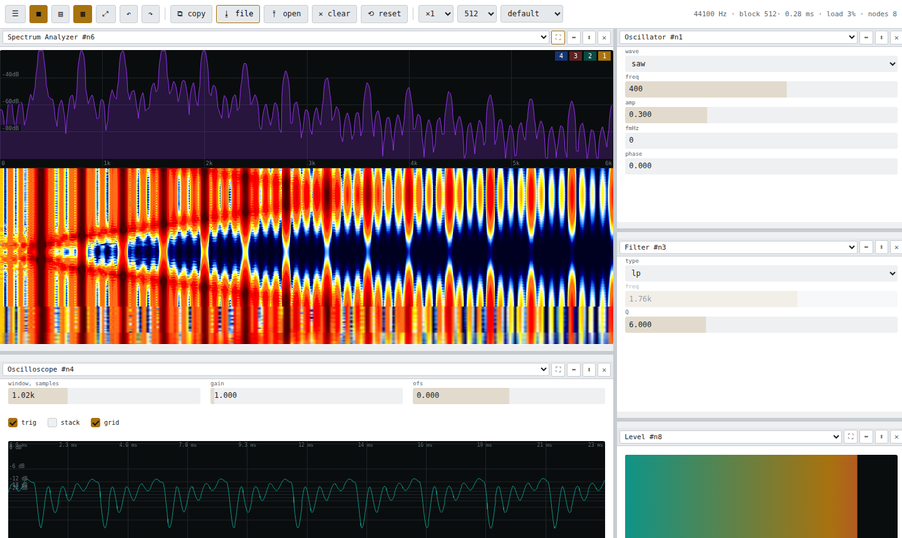 |
| Tablet — graph | 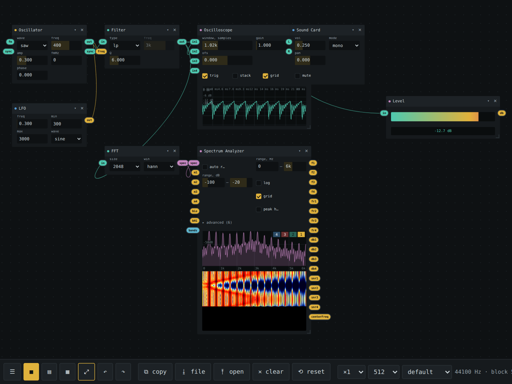 | 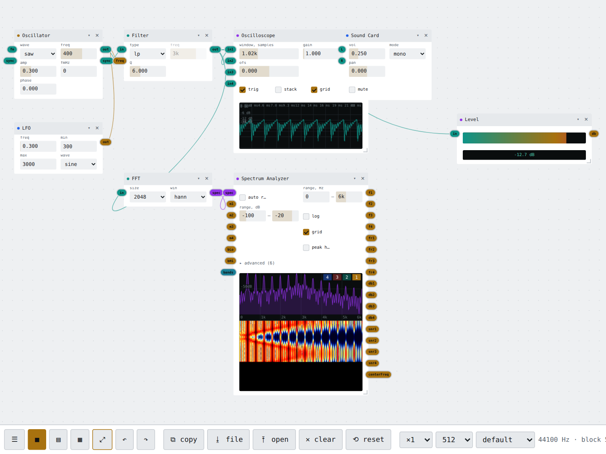 |
| Tablet — dashboard tiles | 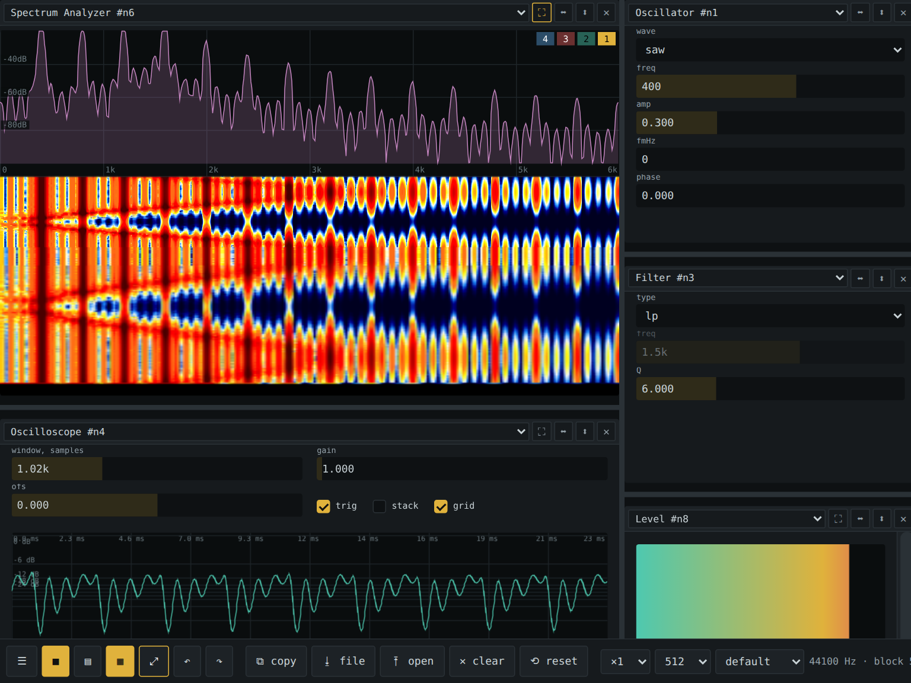 | 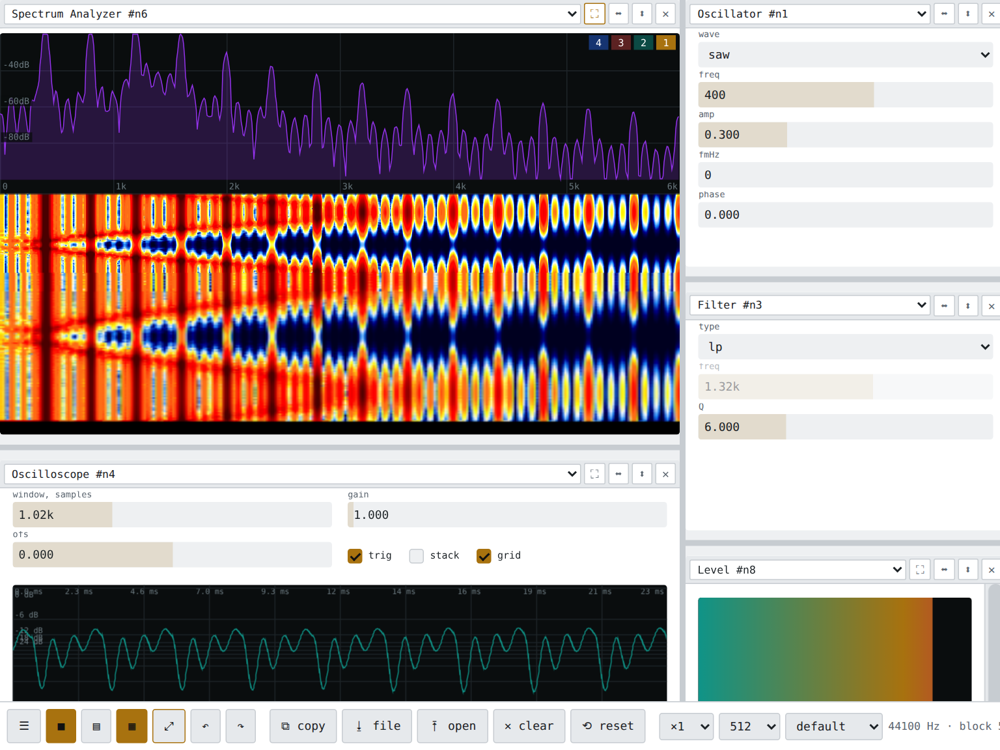 |
| Phone — graph | 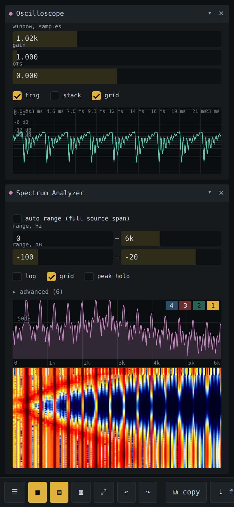 | 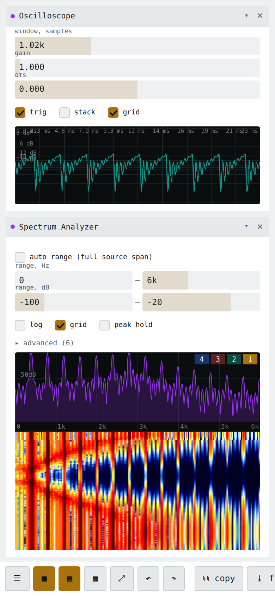 |
| Phone — dashboard tiles | 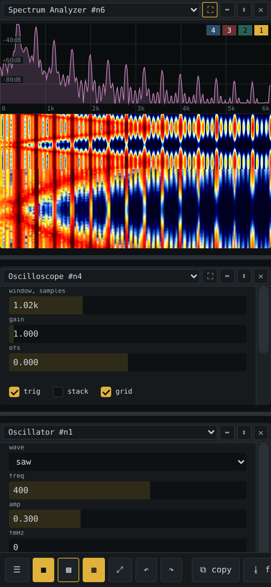 | 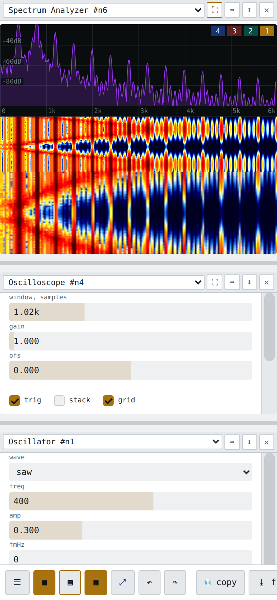 |

### Dashboard tiles

The ▦ button switches to a tiled dashboard built from the modules of the current patch:

- Pick any module for each pane from its dropdown
- Split panes right (⬌) or down (⬍), remove them (✕), drag dividers to resize
- ⛶ shows only the module's display, without controls and header
- The layout is saved with the patch and works on touch devices (wide scroll rail for long panes)

## Screenshots

### SDR software

### WeFax

### ft8

### RTTY

### Chirp modem (wip)

### Music making (wip)

### Generator + Oscilloscope

### Misc

